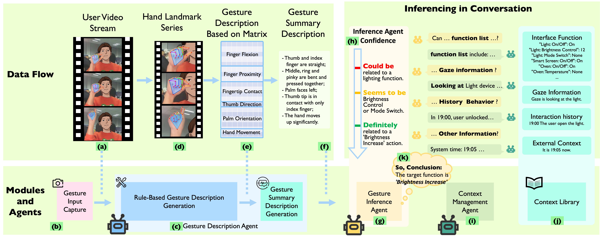

### GestureGPT

Existing gesture interfaces only works with a fixed gesture set defined either by interface designers or by users themselves, which introduces learning or demonstration effort that diminishes their naturalness. 
Humans, on the other hand, understands free-form gestures by synthesizing the gesture, context, experience, and common sense.
In this way, the use does not need to learn, demonstrate, or associate gestures. 
So we introduce GestureGPT, a free-form hand gesture understanding framework that mimic human gesture understanding procedures to make natural free-form gestural interface possible. 
Our framework leverages multiple large language model (LLM) agents to manage and synthesize gestural and context information, then infers the interaction intent by associating the gesture to a function provided by the interface.
More specifically, our triple-agent framework involves a Gesture Description Agent that automatically segments and formulates natural language descriptions of hand poses and movements based on hand landmark coordinates. 
The description is deciphered by a Gesture Inference Agent through self-reasoning and querying about the interaction context (\eg interaction history, gaze data), which is managed by a Context Management Agent. 
Following iterative exchanges, the Gesture Inference Agent discerns the user intent by grounding it to an interactive function. 
We validated our framework offline under two real-world scenarios: smart home controlling and online video streaming. 
The average zero-shot Top-1/Top-5 grounding accuracies are 44.79\%/83.59\% for smart home tasks and 37.50\%/73.44\% for video streaming. 
We also provided an extensive discussion including model selection rationale, generalizability, and future research directions for a practical system etc.